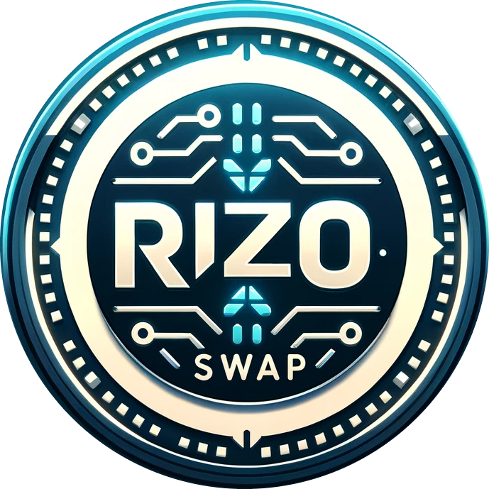

# RIZO TOKEN

RIZO | Unlocking the Potential of a Multi-functional Blockchain Contract



## Table of Contents

- [Introduction](#introduction)
- [Features](#features)
- [Getting Started](#getting-started)
- [Usage](#usage)
- [Contributing](#contributing)
- [License](#license)

## Introduction

Welcome to the RIZO TOKEN project! RIZO TOKEN is a multifunctional blockchain contract designed to revolutionize the world of digital assets. Combining the power of ERC-20, ERC-2612, and ERC-677 standards, along with custom functionalities, this contract is set to redefine what's possible on the blockchain.

## Token Information

- **Token Name**: Rizo
- **Symbol**: RIZO
- **Contract Address**: 0x13A92eBc97E294058ed69943b20F08eFdAa06bff
- **FTMScan**: https://ftmscan.com/address/0x13a92ebc97e294058ed69943b20f08efdaa06bff
- **Logo**: [https://github.com/RizoSwap/RizoToken/RizoLogo.png](https://github.com/RizoSwap/RizoToken/blob/51c55c61f8c031d530165e392c473d518e5401e1/RizoLogo.png)

## Usage
DeFi Ecosystems: RIZO TOKEN is perfect for DeFi projects, offering gas-efficient approvals and smart contract interaction to improve user experience and efficiency.

Cross-Chain Tokenization: Utilize RIZO TOKEN's cross-chain compatibility to enable token movement between different blockchains, expanding accessibility.

Asset Tokenization: Tokenize real-world assets such as real estate, art, or stocks using RIZO TOKEN. The ownership transition feature adds flexibility.

Enhanced Security: Prioritize security and protect user assets by leveraging RIZO TOKEN's security features.

Governance and DAOs: Use RIZO TOKEN in projects with decentralized autonomous organizations (DAOs), where governance models may evolve over time.

## Features

- **ERC-20 Core**: At its core, RIZO TOKEN functions as an ERC-20 token, making it highly versatile and compatible with various blockchain ecosystems.

- **Gas-Efficient Approvals (ERC-2612)**: RIZO TOKEN introduces the gas-efficient "permit" function, allowing users to approve token transfers without costly on-chain transactions. Perfect for decentralized finance (DeFi) applications.

- **Smart Contract Interaction (ERC-677)**: Inspired by ERC-677, RIZO TOKEN enables seamless interaction with other smart contracts, automating complex processes within a single transaction.

- **Cross-Chain Compatibility**: RIZO TOKEN is designed with cross-chain functionality in mind, making it a bridge between different blockchains and expanding its accessibility.

- **Ownership Transition**: The contract includes a mechanism for changing ownership, a vital feature for governance models and administrative purposes.

- **EIP712 Compliance**: RIZO TOKEN enhances security and usability with EIP712 compliance, providing readable and secure off-chain message signing.

- **Security and Safety Features**: Leveraging libraries like SafeERC20 and checks like Address.isContract, RIZO TOKEN prioritizes security, reducing the risk of vulnerabilities.

  ## RIZO Rocket


                  
                  |
                 / \
                |   |
                |   |
                |   |
                |   |
                | R |
                | I |
                | Z |
                | O |
                |   |
                | T |
                | O |
                | K |
                | E |
                | N |
                |   |
               /| |\ \
              / | | | \
             /  | | |  \
            /   | | |   \
           /____| | |____\
               [_____]
                \___/

## RIZ0

   RRRRRRR  IIIII ZZZZZZZZ   OOOOO  
   RR   RRR  III     ZZZ   OO     OO 
   RRRRRRR   III   ZZZ     OO     OO 
   RR  RR    III  ZZZ      OO     OO 
   RR   RR  IIIII ZZZZZZZZ   OOOO0  

    TTTTTTTTT OOOOO  K  K EEEEE  N   N 
       TTT   OO   OO K K  E      NN  N 
       TTT   OO   OO KK   EEEE   N N N 
       TTT   OO   OO K K  E      N  NN 
       TTT    OOOO0  K  K EEEEE  N   N


  

## Getting Started

To embark on your journey with RIZO TOKEN, follow these steps if you wish.

1. **Clone the Repository**: Begin by cloning this repository to your local machine:

   ```bash
   git clone https://github.com/RizoSwap/RizoToken.git
